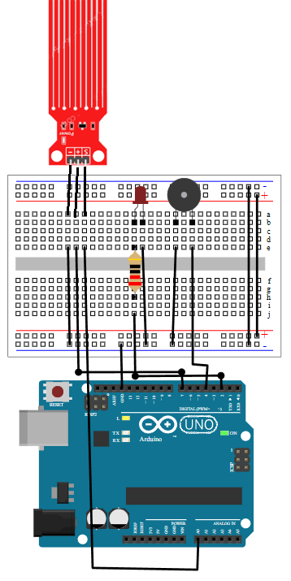
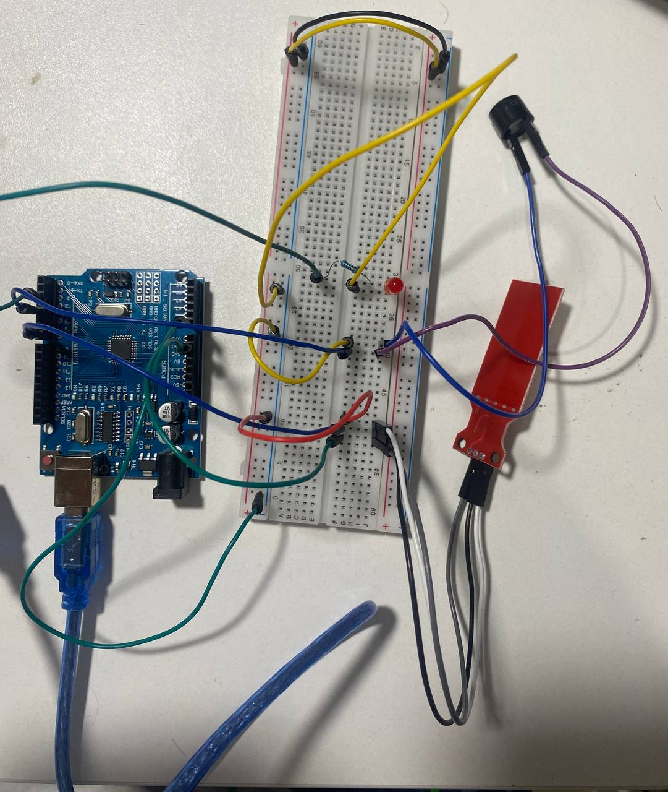

# **`Arduino` water level alarm**


This is source code and build for `Arduino` water level alarm
#### The buzzer will beep and LED will flash if water level is above certain level. You can enter level manualy and then rebuild project and load to the board.

#### You can configure ports and water level limit in variables below:
```C++
#define _LED_INDICATOR_PIN 2
#define _BUZZER_PIN 4
#define _SENSOR_POWER_PIN 7
#define _SENSOR_READ_PIN A0
#define _SIGNAL_DELAY_MS 500
```

### Hardware that i've used:
- `Arduino UNO r3`
- Water level indicator
- Red LED
- 220R resistor
- Buzzer
- Breadboard

### Software that i've used:
- `UNO r3 driver`
- `VScode`
- `PlatformIO`

### Circuit schema:


### Circuit IRL:



